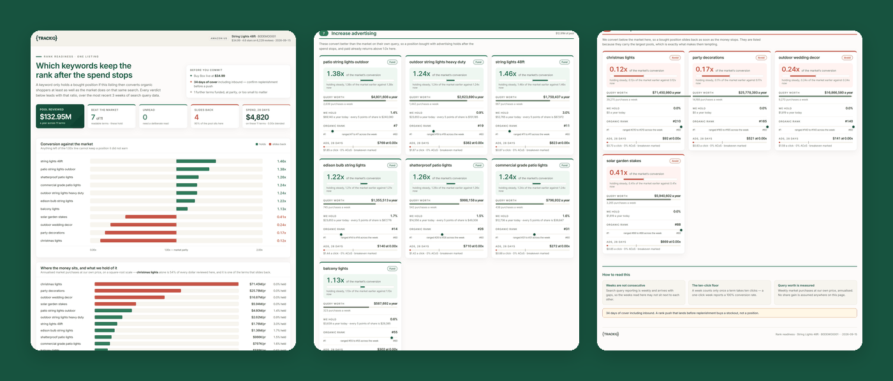

# TrackIQ: Amazon Rank Readiness

Decides which search terms are worth putting advertising or seeding money
behind on a single ASIN — by testing whether the rank you buy would **survive
the money stopping**.

Spend can buy an organic position on almost any term. You only keep it if the
listing then converts organic shoppers at least as well as the market does on
that same search. Convert worse and Amazon hands the slot back: you bought a
spike, not a position.

Built as an [Agent Skill](https://code.claude.com/docs/en/skills). Runs in
Claude Code, Claude web, Claude desktop and ChatGPT from the same folder.

---

## Powered by the TrackIQ MCP

[](https://trackiq.com/mcp)

This skill reads your live Amazon account through the
**[TrackIQ MCP](https://trackiq.com/mcp)** — 16 tools connecting your AI
assistant to Amazon data:

Sales & Traffic · Orders · Inventory · Returns · Sponsored Products · Sponsored
Brands · Sponsored Display · Amazon DSP · AMC Cloud · Keywords · Search Terms ·
Targeting · Search Query Performance · Organic Rank · Best Seller Rank · Buy Box
History · Brand Analytics · Export

**No third-party API.** Inputs are saved TrackIQ pulls read from disk, and
there are no network calls at run time — so a run is reproducible from its
inputs.

Works with Claude, ChatGPT and Cursor. **[Get access →](https://trackiq.com/mcp)**

---

## What you get



*One report, three views: the cover with conversion against the market and
where the money sits, the funded keywords, then the terms to avoid.*

A terminal verdict list and a self-contained HTML report. Every verdict turns
on one measurement — your conversion rate against the market's, on the same
query, in the weeks that are actually readable.

| Verdict | Means | Do |
|---|---|---|
| **FUND** | out-converts the market, and paid already returns above breakeven | increase advertising |
| **SEED** | out-converts the market, but clicks cost more than they return | buy the rank with reviews and seeding, not CPC |
| **TEST** | too few readable weeks to tell | buy a small deliberate read first |
| **NO-GO** | converts below the market | don't push — it will slide back |

### The negative work is the point

The highest-volume terms in a category are usually the ones a niche product
converts worst on — which is exactly what makes them tempting. They get listed
with their pool and their losing ratio, so the case against them is visible
rather than rediscovered every quarter.

In the demo render above, one term carries a **$71M** annual pool at **0.12×**
the market's conversion. Ranked by volume it would top the list. Ranked by
whether the rank would hold, it's a NO-GO.

### Sizing is measured, never projected

It reports what a query is worth a year at **your own price** and the share you
hold **today**, and stops there. No forecast of a share you might reach.

## Requirements

- The **TrackIQ MCP**, for `get_search_query_performance` (required), plus
  `get_keyword_rank` and `get_search_terms` (optional)
- **A filesystem.** Inputs are saved pulls read from disk and the report is
  written to disk. This is the one TrackIQ skill that needs it.
- No third-party API, and no network at run time.

**Without the scripts**, the bundled Python only does arithmetic and layout —
`assets/method.md` carries every threshold and `assets/pulling-data.md` the
exact calls, so the same verdicts can be produced by hand.

---

## Install

### Claude Code

```
/plugin marketplace add TrackIQ-HQ/amazon-seller-skills
/plugin install trackiq-amazon-rank-readiness@trackiq
```

### Claude web, desktop, mobile

1. Download the `.zip` from the
   [latest release](https://github.com/TrackIQ-HQ/trackiq-amazon-rank-readiness/releases)
2. **Settings → Capabilities → Skills** (code execution must be on)
3. **Create skill → Upload a skill**, choose the `.zip`
4. Toggle it on

### ChatGPT

Same zip. **Plugins → Skills → Create → Upload from your computer.**

---

## Setup

Answers live in `account.md`, copied from
[`assets/account.example.md`](skills/trackiq-amazon-rank-readiness/assets/account.example.md).
**Every TrackIQ skill reads the same file.**

You also write a small **context file** — price, rating, reviews, days of cover,
Buy Box state. All optional; the verdicts stand without it, but the report is
thinner and the two hard gates go unstated.

## Delivery

Asked once and stored in `account.md`: **in-chat** (default), **file**,
**Slack**, **n8n** or **email**. Anything leaving the chat confirms with you
first and falls back to in-chat, with a note.

## When to run it

Before a launch push, a rebate or seeding drip, or a rank-and-bank PPC
campaign — and to diagnose why a rank push didn't hold.

It pairs with the other two search skills:
[Category Priority Keywords](https://github.com/TrackIQ-HQ/trackiq-amazon-category-priority-keywords)
decides which terms are worth tracking,
[Search Visibility Audit](https://github.com/TrackIQ-HQ/trackiq-amazon-search-visibility-audit)
reports how you're doing on them, and this one decides where to spend.

---

## Customizing

| To change | Edit |
|---|---|
| Brand, ASIN, delivery | `account.md` — no skill edits |
| Every threshold, and the reasoning behind it | `assets/method.md` |
| The exact pulls and their data quirks | `assets/pulling-data.md` |
| The scoring | `assets/readiness.py` |
| The report | `assets/report.py` |

`method.md` is the one worth reading before changing anything — it traces
every threshold back to the wrong answer that produced it, so you can see what
a change would let back in.

`assets/readiness.py --selfcheck` runs the built-in test and must print
`selfcheck OK`.

---

## Contributing

```bash
python scripts/validate.py    # must exit 0 before any commit
python scripts/build.py       # writes dist/ zip + registry.json
```

Read [AUTHORING.md](https://github.com/TrackIQ-HQ/amazon-seller-skills/blob/main/AUTHORING.md)
before proposing changes.

## License

MIT. See [LICENSE](LICENSE).
